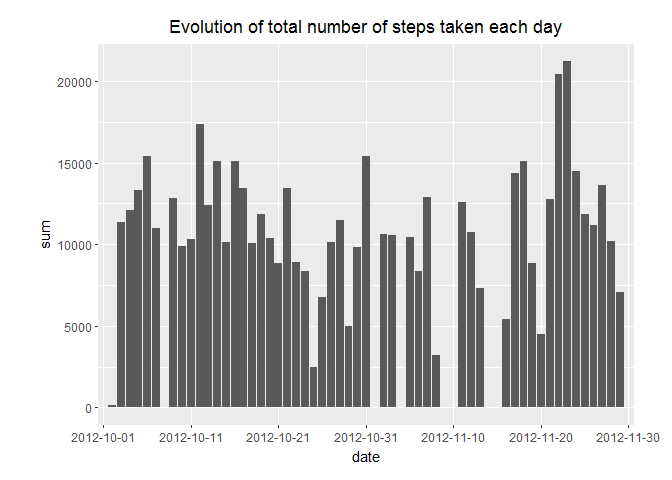
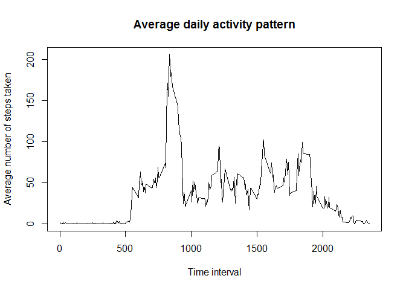
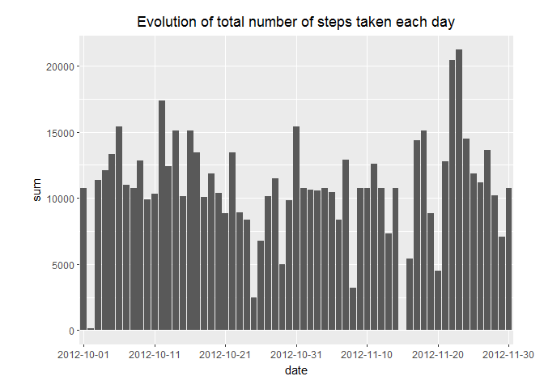
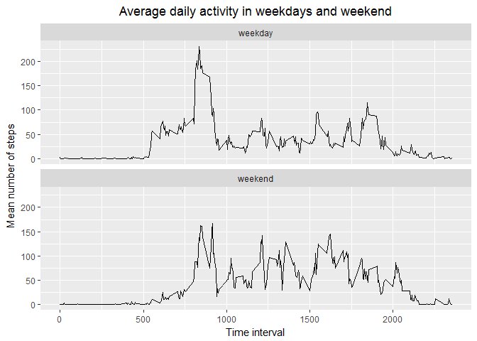

## Loading and preprocessing the data
The data are loaded directly from the zip file activity.zip. The code to do so is shown below.


```r
library("dplyr")
```

```
## 
## Attaching package: 'dplyr'
```

```
## The following objects are masked from 'package:stats':
## 
##     filter, lag
```

```
## The following objects are masked from 'package:base':
## 
##     intersect, setdiff, setequal, union
```

```r
library("ggplot2")
```

```
## Warning: package 'ggplot2' was built under R version 3.4.4
```


```r
df <- read.csv(unzip("activity.zip"), header = TRUE, sep = ",")
```


## What is mean total number of steps taken per day?

The first step is to calculate the total number of step for each day. The NA values are removed from the calculation.


```r
a <- df %>%
  group_by(date) %>%
  summarise(sum = sum(steps, na.rm = TRUE))
```

Then to see a bit more easily how that total number of steps vary in function of day, a histogramm has been plotted.


```r
ggplot(data = a, aes(date, sum)) + 
  geom_bar(stat = "identity") + 
  labs(title = "Evolution of total number of steps taken each day") +
  theme(plot.title = element_text(hjust = 0.5), plot.margin = unit(c(0.5,1,0.5,1), "cm")) +
  scale_x_discrete(breaks = c(as.character(a$date[[1]]), as.character(a$date[[11]]), as.character(a$date[[21]]), as.character(a$date[[31]]), as.character(a$date[[41]]), as.character(a$date[[51]]), as.character(a$date[[61]])))
```

<!-- -->

```r
ggsave("plot1.png", path = "D:\\Git_Coursera\\RepData_PeerAssessment1\\instructions_fig", device = "png")
```

```
## Saving 7 x 5 in image
```

Then the mean and the median of the total number of steps per day is calculated.


```r
options(digits = 2)
mean_steps <- mean(a$sum)
median_steps <- median(a$sum)
```

The mean of the total number of steps taken per day is 9354.23 and the median is 10395.


## What is the average daily activity pattern?

To obtain the average daily activity pattern, the following code was run. All the NA values were removed.


```r
b <- df %>%
  group_by(interval) %>%
  summarise(mean = mean(steps, na.rm = TRUE))

plot(b, type = "l", ylab = "Average number of steps taken", xlab = "Time interval")
title(main = "Average daily activity pattern")
```

<!-- -->

```r
dev.copy(png, file = "D:\\Git_Coursera\\RepData_PeerAssessment1\\instructions_fig\\plot 2.png")
```

```
## png 
##   3
```

```r
dev.off()
```

```
## png 
##   2
```

```r
time_interval <- b$interval[which(b$mean == max(b$mean))]
```

We can observe that there is a maximum in the average daily step number. This maximum is obtained at the 835th time interval.

## Imputing missing values


```r
nb_NA <- sum(is.na(df$steps))
```
There are 2304 NA values in the data set.

In my opinion, the best to do to replace these NA values is to take the corresponding daily average of steps calculated in the previous part. Meaning that for each given interval where there is a NA value, this one will be replaced by the corresponding daily average of steps.
A new data set is created, called df_new.


```r
df_new <- data.frame(steps = numeric(), date = factor(), interval = integer() )

for (i in 1: dim(df)[[1]]) {
  if(is.na(df$steps[i]) == TRUE) {
    
    newrow <- data.frame(steps = b$mean[which(df$interval[i] == b$interval)], date = df$date[i], interval = df$interval[i])
    df_new <- rbind(df_new,newrow)
    
  } else {
    newrow <- data.frame(steps = df$steps[i], date = df$date[i], interval = df$interval[i])
    df_new <- rbind(df_new,newrow) 
  }
}
```

After that, it is possible to make a new histogramm of the total number of steps per day.


```r
c <- df_new %>%
  group_by(date) %>%
  summarise(sum = sum(steps))

ggplot(data = c, aes(date, sum)) + 
  geom_bar(stat = "identity") + 
  labs(title = "Evolution of total number of steps taken each day") +
  theme(plot.title = element_text(hjust = 0.5), plot.margin = unit(c(0.5,1,0.5,1), "cm")) +
  scale_x_discrete(breaks = c(as.character(c$date[[1]]), as.character(c$date[[11]]), as.character(c$date[[21]]), as.character(c$date[[31]]), as.character(c$date[[41]]), as.character(c$date[[51]]), as.character(c$date[[61]])))
```

<!-- -->

```r
ggsave("plot3.png", path = "D:\\Git_Coursera\\RepData_PeerAssessment1\\instructions_fig", device = "png")
```

```
## Saving 7 x 5 in image
```

```r
options(digits = 3)
mean_steps_new <- mean(c$sum)
median_steps_new <- median(c$sum)
```

The average is now equal to 1.077\times 10^{4} and the median is now equal to 1.077\times 10^{4}.
We can observe that the mean and median have increased when the NA values are replaced. We notice also that in that case the median and the mean are equal.

## Are there differences in activity patterns between weekdays and weekends?

This last part is about the difference in activity between the weekdays and the weekend.
So first, a new column in df_new is built indicating whether a given date is a weekday or a weekend day.


```r
Sys.setlocale("LC_TIME", "English")
```

```
## [1] "English_United States.1252"
```

```r
for (i in 1:dim(df_new)[[1]]) {
  if(any(weekdays(as.Date(df_new$date[i])) == c("Monday", "Tuesday", "Wednesday", "Thursday", "Friday"))) {
    
    df_new$weektime[i] <- "weekday"
  } else {
    
    df_new$weektime[i] <- "weekend"
  }
    
}
df_new$weektime <- factor(df_new$weektime)
```

After that, it is possible to calculate the average number of steps over day for weekdays and weekend days.


```r
d <- df_new %>%
  group_by(interval, weektime) %>%
  summarise(mean = mean(steps))

ggplot(d, aes(interval, mean)) +
  geom_line() +
  facet_wrap(~weektime, nrow = 2, ncol = 1) +
  labs( title = "Average daily activity in weekdays and weekend", y = "Mean number of steps", x = "Time interval") +
  theme(plot.title = element_text(hjust = 0.5))
```

<!-- -->

```r
ggsave("plot4.png", path = "D:\\Git_Coursera\\RepData_PeerAssessment1\\instructions_fig", device = "png")
```

```
## Saving 7 x 5 in image
```

It can be observed that there is more variation during the weekdays than during the weekend.
